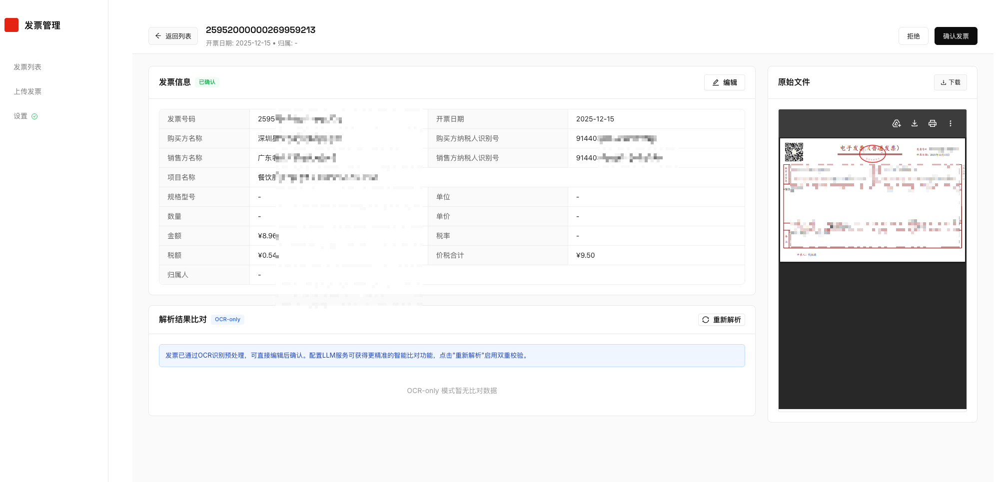
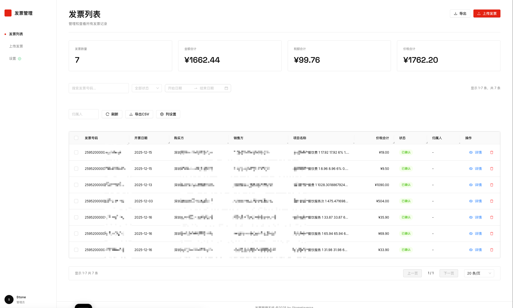
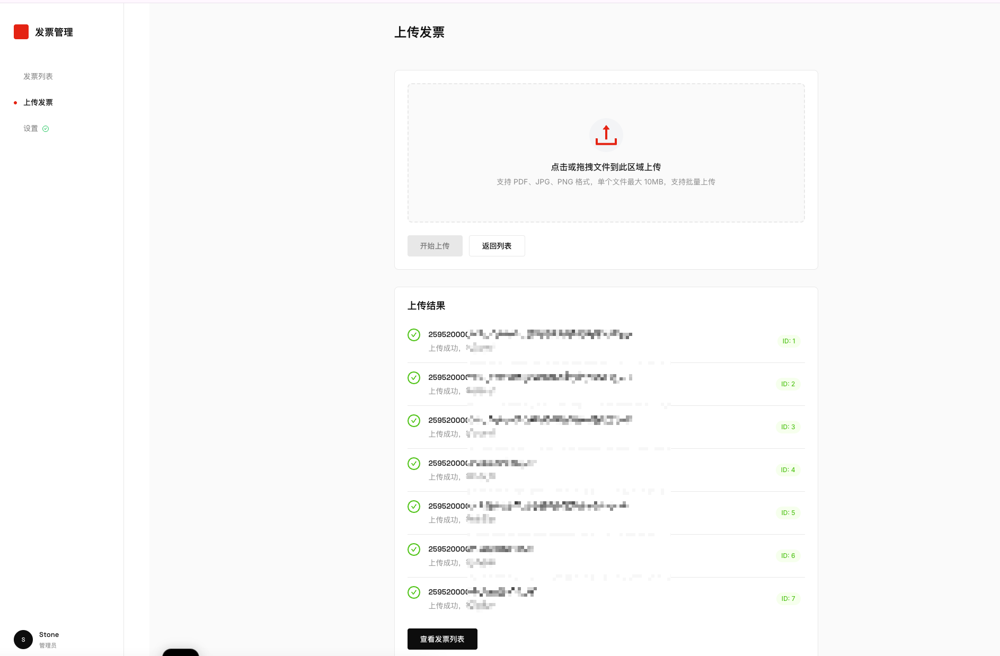

<div align="center">

# Invoice Manager 🧾

### AI-Powered Chinese Invoice Recognition with Dual-Source Verification
### AI驱动的中文发票识别系统 · OCR+LLM双源验证

**v0.3.0** | Latest Release: 2026-01-24

[](https://opensource.org/licenses/MIT)
[](https://www.python.org/)
[](https://fastapi.tiangolo.com/)
[](https://reactjs.org/)
[](https://www.docker.com/)
[](https://github.com/PaddlePaddle/PaddleOCR)

**[English](#-highlights) | [简体中文](#-亮点)**

<br/>

> 🎯 **不只是OCR，是让AI帮你双重检查每一张发票**
>
> 传统OCR识别率只有70-80%，商业方案价格昂贵。Invoice Manager 使用 **OCR + LLM 双源验证**，
> 让两个AI互相校验，准确率大幅提升，而且完全免费开源！

</div>

---

## ✨ Highlights

- **🔍 Dual-Source Verification** - OCR + LLM double-check every field, conflicts auto-flagged for review
- **🤖 Multi-LLM Support** - GPT-4o / Claude / Gemini / Qwen / DeepSeek / Zhipu GLM
- **🇨🇳 Chinese Invoice Optimized** - PaddleOCR + custom prompts for VAT invoices (增值税发票)
- **⚡ Parallel Processing** - OCR and LLM run simultaneously for faster results
- **🐳 One-Click Deploy** - Docker Compose, ready in 3 minutes
- **🔒 Privacy First** - Self-hosted, your data never leaves your server

## ✨ 亮点

- **🔍 双源验证** - OCR + LLM 双重识别，字段冲突自动标记待审核
- **🤖 多模型支持** - 支持 GPT-4o / Claude / Gemini / 通义千问 / DeepSeek / 智谱GLM
- **🇨🇳 中文发票优化** - PaddleOCR 深度优化 + 增值税发票专用提示词
- **⚡ 并行处理** - OCR 和 LLM 同时运行，识别更快
- **🐳 一键部署** - Docker Compose 启动，3分钟搞定
- **🔒 数据安全** - 本地私有部署，数据不离开服务器

---

## 📦 版本更新 | Changelog

### v0.3.0 (2026-01-24) - UI 全面改版 | UI Redesign

**🎨 全新设计系统 | New Design System**
- 采用 Swiss Clean Web Dashboard 设计风格，专业简洁
- 全新配色方案：朱红色品牌色 (#E42313) + 清爽白灰色调
- 字体升级：Space Grotesk (标题) + Inter (正文)
- 统一的圆角、边框、间距设计规范

**🧩 新增组件 | New Components**
- **Sidebar 侧边栏导航** - 替代顶部导航，提供更清晰的页面结构
- **MetricCard 统计卡片** - 发票列表页顶部显示关键统计数据
- **StatusTag 状态标签** - 统一的状态展示组件 (待审核/处理中/已确认等)
- **ControlBar 控制栏** - 搜索、筛选、操作按钮的统一布局

**📄 页面重构 | Page Redesign**
- **发票列表页** - 全新布局，新增4个统计卡片展示发票数量、金额合计、税额合计、价税合计
- **发票详情页** - 双栏布局 (数据卡片 + PDF预览)，**OCR vs LLM 差异可视化高亮** (红色背景标记不匹配字段)
- **上传页面** - 简洁的拖拽上传区域，品牌化设计

**✨ 关键 UX 改进 | Key UX Improvements**
- **差异可视化** - OCR 与 LLM 识别结果对比表，不匹配字段自动红色高亮
- **匹配计数器** - "X/Y 字段匹配" 直观显示识别一致性
- **状态图标** - ✓/✗ 图标快速识别匹配状态
- **更好的层级** - 卡片式设计，信息分组更清晰

**⚙️ 后端增强 | Backend Improvements**
- OpenRouter 模型支持 - 接入更多最新 AI 模型
- 审计日志 - 记录关键操作
- 速率限制 - 防止 API 滥用
- OCR 服务优化 - 更好的中文发票识别
- 改进的 LLM 提示词 - 更精准的发票信息提取

**🎯 设计文件 | Design Files**
- 新增 `docs/invoice-manager.pen` - 完整的 UI 设计稿 (Pencil 格式)
- 新增 `docs/UI_REDESIGN.md` - 设计规范文档

---

### v0.2.0 - 多LLM支持 + 双源验证

- 支持 6 种 LLM 提供商 (OpenAI, Anthropic, Google, 阿里云, DeepSeek, 智谱)
- OCR + LLM 双源验证机制
- 冲突检测与人工复核流程

### v0.1.0 - 基础版本

- PaddleOCR 中文发票识别
- 基础的发票管理 CRUD
- Docker 一键部署

---

## 🖼️ 截图预览 | Screenshots

<div align="center">

### 发票详情 & OCR vs LLM 比对 | Invoice Detail & Dual-Source Comparison



*左侧：发票基础信息和原始文件预览 | 下方：OCR与LLM识别结果对比，可一键选择或自定义*

</div>

**截图亮点 | Screenshot Highlights:**
- 📋 **发票信息卡片** - 清晰展示所有提取字段
- 📄 **原始文件预览** - PDF/图片内嵌预览，无需下载
- ⚖️ **OCR vs LLM 比对表** - 并排显示两种识别结果
- 🏷️ **状态标签** - 已解决/待确认，一目了然
- 🖱️ **一键选择** - 点击"选择"采用该结果，或"自定义"手动输入

---

### 列表页面



### 上传页面



## 🎯 解决的问题 | Problem Solved

<table>
<tr>
<td width="50%">

### 😫 传统方式的痛点

- ❌ 手动录入发票信息，费时费力
- ❌ 单一OCR识别率不够高（70-80%）
- ❌ 商业方案价格昂贵（按张收费）
- ❌ 现有开源方案功能单一
- ❌ 数据上传第三方，隐私风险

</td>
<td width="50%">

### 😊 Invoice Manager 的解决方案

- ✅ 自动识别，批量上传处理
- ✅ 双源验证，准确率显著提升
- ✅ 完全免费，MIT 开源协议
- ✅ 全流程管理，从识别到报销
- ✅ 本地部署，数据完全可控

</td>
</tr>
</table>

---

## 🏗️ 核心架构 | Architecture

```
                              ┌─────────────────┐
                              │   发票上传       │
                              │  Invoice Upload  │
                              └────────┬────────┘
                                       │
                    ┌──────────────────┼──────────────────┐
                    │                  │                  │
                    ▼                  │                  ▼
           ┌───────────────┐           │         ┌───────────────┐
           │   PaddleOCR   │           │         │   LLM Vision  │
           │   中文OCR识别  │           │         │  GPT-4/Claude │
           └───────┬───────┘           │         └───────┬───────┘
                   │                   │                 │
                   │         ┌────────────────┐          │
                   └────────►│  智能比对引擎  │◄─────────┘
                             │ Diff Engine   │
                             └───────┬───────┘
                                     │
                    ┌────────────────┼────────────────┐
                    ▼                                 ▼
           ┌───────────────┐                 ┌───────────────┐
           │   ✅ 匹配      │                 │   ⚠️ 冲突     │
           │  自动确认      │                 │  人工复核     │
           │  CONFIRMED    │                 │  REVIEWING    │
           └───────────────┘                 └───────────────┘
```

**Why Dual-Source Verification Works | 为什么双源验证更准确**

| 场景 | 单一OCR | 单一LLM | 双源验证 |
|-----|--------|---------|---------|
| 模糊字符 | ❌ 可能误识别 | ✅ 理解上下文 | ✅ 互相校验 |
| 非标准格式 | ❌ 正则失效 | ✅ 智能解析 | ✅ 双重保障 |
| 金额数字 | ✅ 精确识别 | ⚠️ 可能幻觉 | ✅ 数值比对 |
| 处理成本 | 💰 低 | 💰💰 高 | 💰 按需调用 |

---

## 🚀 快速开始 | Quick Start

### 最简3步启动 | 3 Steps to Start

```bash
# 1. 克隆项目 | Clone
git clone https://github.com/YOUR_USERNAME/invoice_manager.git
cd invoice_manager

# 2. 配置LLM (可选) | Configure LLM (Optional)
# 在 backend/.env 中设置 API Key，或稍后在界面中配置
# Set API Key in backend/.env, or configure later in UI

# 3. 启动服务 | Start Services
docker-compose up -d
```

### 访问地址 | Access URLs

| 服务 | 地址 | 说明 |
|-----|------|------|
| 前端界面 | http://localhost:15173 | 主操作界面 |
| 后端 API | http://localhost:18080 | REST API |
| API 文档 | http://localhost:18080/docs | Swagger UI |

### 配置 LLM | Configure LLM

系统支持 **6 种 LLM 提供商**，可在界面中实时切换：

| Provider | Models | 获取 API Key |
|----------|--------|-------------|
| OpenAI | GPT-4o, GPT-4o-mini | [platform.openai.com](https://platform.openai.com/) |
| Anthropic | Claude 3.5 Sonnet, Claude 3 Opus | [console.anthropic.com](https://console.anthropic.com/) |
| Google | Gemini 1.5 Pro, Gemini 1.5 Flash | [aistudio.google.com](https://aistudio.google.com/) |
| 阿里云 | 通义千问 Qwen-VL | [dashscope.console.aliyun.com](https://dashscope.console.aliyun.com/) |
| DeepSeek | DeepSeek-VL | [platform.deepseek.com](https://platform.deepseek.com/) |
| 智谱 | GLM-4V | [open.bigmodel.cn](https://open.bigmodel.cn/) |

> 💡 **提示**: 即使不配置LLM，系统也能正常运行（仅使用OCR）。配置LLM后可获得双源验证能力。

---

## 📋 功能特性 | Features

### 发票处理 | Invoice Processing

| 功能 | 描述 |
|-----|------|
| 📤 批量上传 | 支持 PDF、JPG、PNG，单次多文件上传 |
| 🔍 OCR识别 | PaddleOCR 中文优化，300DPI 高清识别 |
| 🤖 LLM解析 | Vision 模型直接理解发票图像 |
| ⚖️ 智能比对 | 自动对比OCR和LLM结果，标记差异 |
| ✏️ 人工复核 | 冲突字段可视化，一键选择正确值 |
| 📊 统计报表 | 金额汇总、税额统计、状态分布 |

### 提取字段 | Extracted Fields

```
├── 基础信息
│   ├── 发票号码 (invoice_number)
│   ├── 开票日期 (issue_date)
│   └── 项目名称 (item_name)
│
├── 购买方信息
│   ├── 购买方名称 (buyer_name)
│   └── 购买方税号 (buyer_tax_id)
│
├── 销售方信息
│   ├── 销售方名称 (seller_name)
│   └── 销售方税号 (seller_tax_id)
│
└── 金额信息
    ├── 金额 (amount)
    ├── 税率 (tax_rate)
    ├── 税额 (tax_amount)
    └── 价税合计 (total_with_tax)
```

### 状态流转 | Status Workflow

```
UPLOADED → PROCESSING → REVIEWING → CONFIRMED → REIMBURSED
  上传       识别中       待审核       已确认       已报销
                            ↓
                      NOT_REIMBURSED
                         未报销
```

---

## 📡 API 接口 | API Reference

### 核心接口 | Core Endpoints

```bash
# 上传发票 | Upload Invoice
POST /api/invoices/upload
Content-Type: multipart/form-data

# 获取列表 | Get List (with pagination & filters)
GET /api/invoices?status=REVIEWING&owner=张三&page=1&page_size=20

# 获取详情 | Get Detail (includes OCR, LLM, Diff results)
GET /api/invoices/{id}

# 更新信息 | Update Invoice
PUT /api/invoices/{id}
{
  "invoice_number": "12345678",
  "total_with_tax": "1000.00",
  "status": "CONFIRMED"
}

# 重新处理 | Reprocess
POST /api/invoices/{id}/process?use_ocr=true&use_llm=true

# 批量操作 | Batch Operations
POST /api/invoices/batch-update
POST /api/invoices/batch-delete
POST /api/invoices/batch-reprocess

# 统计数据 | Statistics
GET /api/invoices/statistics

# LLM配置 | LLM Configuration
GET  /api/settings/llm/status
POST /api/settings/llm/configure
POST /api/settings/llm/test
```

完整 API 文档请访问 http://localhost:18080/docs

---

## 🗺️ 路线图 | Roadmap

- [x] **v0.1** - 基础OCR识别 + 发票管理
- [x] **v0.2** - 多LLM支持 + 双源验证
- [x] **v0.3** - UI全面改版 + OpenRouter模型支持 ✨ **当前版本**
- [ ] **v0.4** - 报表导出 (Excel/PDF)
- [ ] **v0.5** - 多用户权限管理
- [ ] **v0.6** - 发票真伪验证 (对接税务API)
- [ ] **v0.7** - 移动端适配
- [ ] **v1.0** - 企业级功能 (审批流程、ERP集成)

欢迎提 Issue 告诉我们你最需要的功能！

---

## 🛠️ 技术栈 | Tech Stack

<table>
<tr>
<td align="center" width="50%">

**Backend**


- FastAPI 0.109 (Async REST API)
- SQLAlchemy 2.0 + asyncpg (Async ORM)
- PaddleOCR 2.7 (Chinese OCR)
- Multi-LLM SDK Integration

</td>
<td align="center" width="50%">

**Frontend**


- React 18.2 + TypeScript
- Vite 5.0 (Build Tool)
- Ant Design 5.13 (UI Components)
- CSS Modules + CSS Variables
- Space Grotesk + Inter (Typography)
- Axios (HTTP Client)

</td>
</tr>
</table>

---

## 📁 项目结构 | Project Structure

```
invoice_manager/
├── backend/                    # FastAPI 后端
│   ├── app/
│   │   ├── models/            # SQLAlchemy 数据模型
│   │   │   └── invoice.py     # Invoice, OcrResult, LlmResult, ParsingDiff
│   │   ├── routers/           # API 路由
│   │   │   ├── invoices.py    # 发票 CRUD + 处理
│   │   │   └── settings.py    # LLM 配置
│   │   ├── services/          # 业务逻辑
│   │   │   ├── ocr_service.py # PaddleOCR 识别
│   │   │   ├── llm_service.py # 多 LLM 调用
│   │   │   └── invoice_service.py # 核心处理流程
│   │   ├── schemas/           # Pydantic 数据验证
│   │   ├── config.py          # 配置管理
│   │   └── main.py            # 应用入口
│   ├── requirements.txt
│   └── Dockerfile
│
├── frontend/                   # React 前端
│   ├── src/
│   │   ├── pages/             # 页面组件
│   │   │   ├── UploadPage.tsx # 上传页面
│   │   │   ├── InvoiceListPage.tsx # 列表页面
│   │   │   └── InvoiceDetailPage.tsx # 详情页面
│   │   ├── components/        # 通用组件
│   │   │   ├── layout/        # 布局组件
│   │   │   │   ├── MainLayout.tsx # 主布局 (侧边栏+内容)
│   │   │   │   └── Sidebar.tsx    # 侧边导航栏
│   │   │   ├── dashboard/     # 仪表盘组件
│   │   │   │   ├── MetricCard.tsx # 统计卡片
│   │   │   │   └── ControlBar.tsx # 控制栏
│   │   │   └── StatusTag/     # 状态标签组件
│   │   ├── styles/            # 全局样式
│   │   │   ├── variables.css  # CSS 变量 (设计规范)
│   │   │   ├── global.css     # 全局样式
│   │   │   └── antd-overrides.css # Ant Design 覆盖
│   │   ├── services/          # API 调用
│   │   └── types/             # TypeScript 类型
│   ├── package.json
│   └── Dockerfile
│
├── docs/                       # 文档
│   ├── images/                # 截图
│   ├── invoice-manager.pen    # UI 设计稿 (Pencil)
│   └── UI_REDESIGN.md         # 设计规范文档
│
├── docker-compose.yml          # 容器编排
└── README.md
```

---

## 🤝 参与贡献 | Contributing

我们欢迎所有形式的贡献！无论是：

- 🐛 **报告 Bug** - 发现问题请提 Issue
- 💡 **功能建议** - 告诉我们你想要什么功能
- 📝 **完善文档** - 帮助改进文档
- 🔧 **提交代码** - Fork & PR

### 本地开发 | Local Development

```bash
# 后端 | Backend
cd backend
python -m venv venv
source venv/bin/activate  # Windows: venv\Scripts\activate
pip install -r requirements.txt
uvicorn app.main:app --reload

# 前端 | Frontend
cd frontend
npm install
npm run dev

# 数据库 | Database (需要先启动 PostgreSQL)
docker-compose up -d db
```

### 代码规范 | Code Style

- Python: Black + isort + flake8
- TypeScript: ESLint + Prettier
- Commit: [Conventional Commits](https://www.conventionalcommits.org/)

---

## 💬 常见问题 | FAQ

<details>
<summary><b>Q: 不配置LLM可以使用吗？</b></summary>

A: 可以！系统会仅使用 PaddleOCR 进行识别。但配置LLM后可以获得双源验证能力，准确率会显著提升。
</details>

<details>
<summary><b>Q: 支持哪些发票类型？</b></summary>

A: 主要针对中国增值税发票（普通发票、专用发票）优化。其他格式的发票也可识别，但字段提取可能不完整。
</details>

<details>
<summary><b>Q: OCR 识别不准怎么办？</b></summary>

A: 1) 确保上传的图片清晰、方向正确；2) 配置LLM进行双源验证；3) 使用人工复核功能修正。
</details>

<details>
<summary><b>Q: 如何选择 LLM 提供商？</b></summary>

A:
- **国内用户**: 推荐通义千问或DeepSeek，速度快、价格低
- **准确率优先**: 推荐 GPT-4o 或 Claude 3.5 Sonnet
- **成本优先**: 推荐 GPT-4o-mini 或 Gemini 1.5 Flash
</details>

<details>
<summary><b>Q: 数据安全吗？</b></summary>

A: 系统完全本地部署，发票数据存储在你自己的服务器上。如果使用LLM，发票图片会发送到LLM提供商，请根据实际情况选择。
</details>

---

## 📜 License

[MIT License](LICENSE) - 可自由使用、修改、商用，但请保留版权声明。

---

## 🙏 致谢 | Acknowledgments

- [PaddleOCR](https://github.com/PaddlePaddle/PaddleOCR) - 强大的中文OCR引擎
- [FastAPI](https://fastapi.tiangolo.com/) - 现代Python Web框架
- [Ant Design](https://ant.design/) - 企业级UI组件库

---

<div align="center">

**如果这个项目对你有帮助，请给一个 ⭐ Star！**

**If this project helps you, please give it a ⭐ Star!**

<br/>

Made with ❤️ for the open source community

[Report Bug](../../issues) · [Request Feature](../../issues) · [Discussions](../../discussions)

</div>

---

<!-- SEO Keywords / 搜索关键词 -->
<!--
发票识别 发票OCR 中文发票 增值税发票 电子发票 发票管理系统 费用报销 财务自动化 票据识别
Invoice OCR Chinese Invoice VAT Invoice Invoice Recognition Document AI Receipt OCR
Expense Management Financial Automation PaddleOCR GPT-4 Claude LLM Invoice
开源发票 免费发票识别 Python发票 FastAPI React 发票数据提取 批量发票处理
Invoice Parser Invoice Scanner Invoice Extractor AI Invoice Processing
-->
